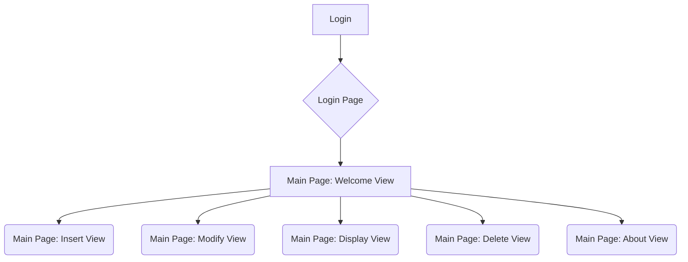
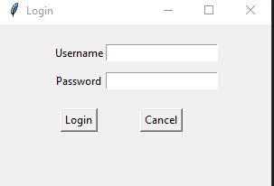
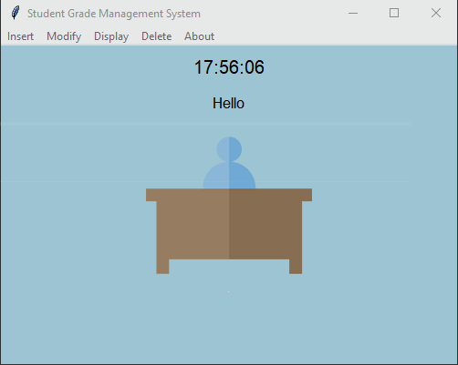
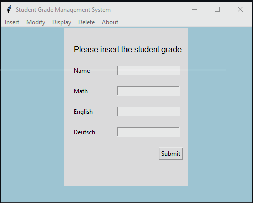
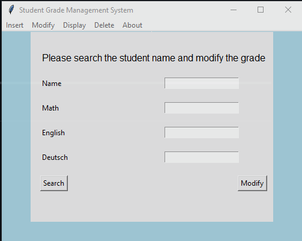
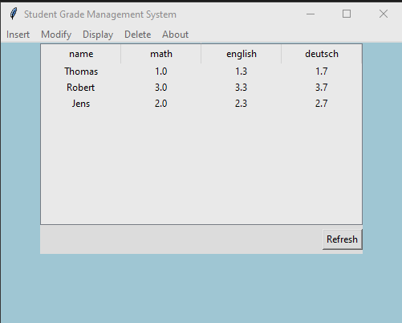
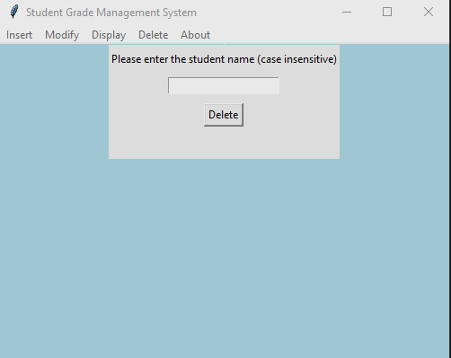
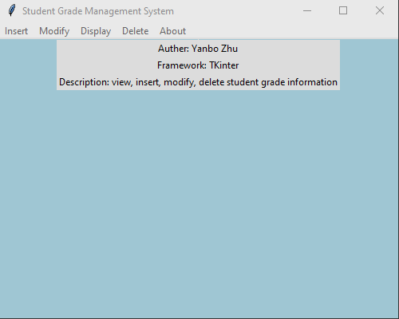

# Student Grade Management System

## System Dependency
Python3
Third Party Dependency ( written in requirements.txt) 

| Depedency | Version |
|-----------|---------|
| Pillow    | 10.3.0  |

## Depolyment process

1. Install the thrid-party Library according to requirements.txt: `pip install -R requirement.txt`
2. run ManagerSystem through execute `python ./main.py`

## Projekt Description
The student grade management system 
User needs to login this system at first. Then the welcome view in main page will be opened. 

After that user can switch to other views through the menu bar to insert, modify, delete, display the student grade information

## Project Structure
- Student_Management_System
  - data: contains source data
    - \_\_init\_\_.py
    - database.py: script for data processing
    - student_grade.json: contains student grade
    - user.json: contains username and password for login
    - welcome.jpg: image for welcome page
  - ui
    - \_\_init\_\_.py
    - LoginPage.py // create Login page
    - MainPage.py // create Main Page. It slaves several View Frames
    - ViewFrame.py
- \_\_init\_\_.py
- README.md
- requirements.txt: Dependency List
- main.py // main function to start this student grade management system

## Chart Flow 

## Login: username and password
| username | password |
|----------|----------|
| admin    | admin    |
| Yanbo    | 123456   |

## Snapchat

### Login Page

### Main Page

Welcome View 

Insert View

Modify View

Display View

Delete View

About View

## Other
@Coding=UTF-8  
@Auther:Yanbo Zhu
@Time:2024-05  
@ProjectName:Student Grade Management System